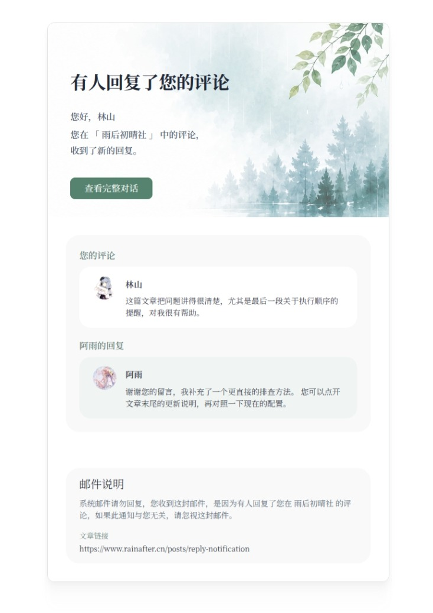
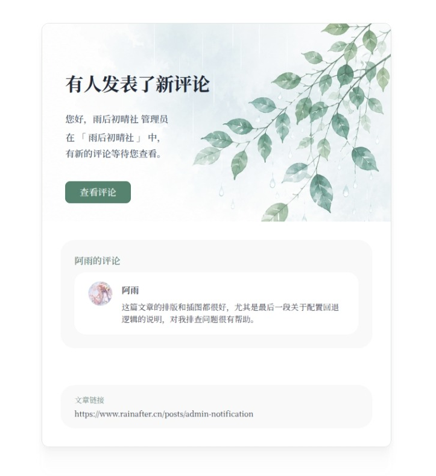
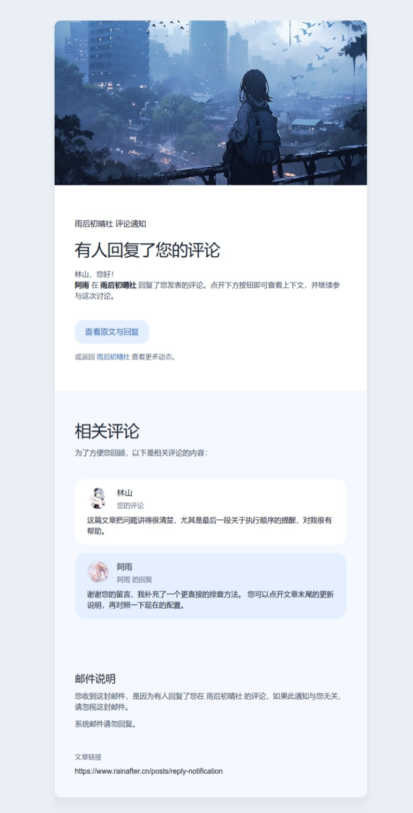
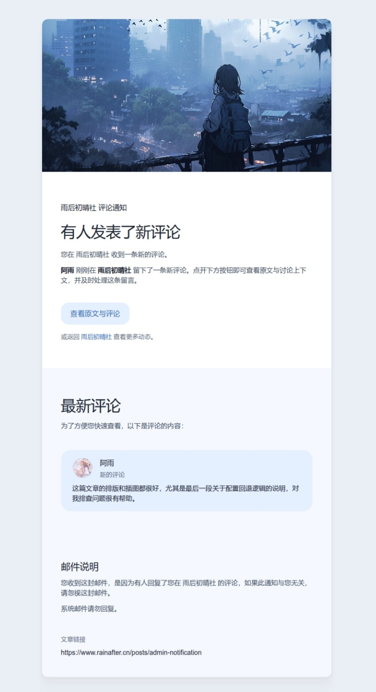

# Rainafter-Twikoo 邮件通知模板

这是一个基于 React Email 开发的用于 Twikoo 评论系统邮件通知模板项目，提供可本地预览、可导出、可定制主题的邮件模板实现。当前仓库内置 `Rainafter` 和 `Fuwari` 两套主题，并分别包含访客回复通知与管理员评论通知模板。

## 功能概览

- 基于 React Email 构建邮件模板，便于开发、预览与导出
- 适用于 Twikoo 评论系统的通知邮件场景
- 内置两套主题：`Rainafter`、`Fuwari`
- 每套主题均包含两类模板：
  - `notification.tsx`：访客收到评论回复通知
  - `notification-admin.tsx`：站点管理员收到新评论通知
- 支持通过配置文件修改主题色、Banner 图片和预览数据
- 支持本地启动预览服务，减少反复发送测试邮件的成本

## 模板预览

### Rainafter 主题
Rainafter 主题以清新简约的设计风格为主，配色柔和。

普通评论回复通知模板



管理员新评论通知模板




### Fuwari 主题
Fuwari 主题参考了知名 Astro 博客主题 [Fuwari](https://github.com/saicaca/fuwari) 的设计风格和配色方案。

普通评论回复通知模板



管理员新评论通知模板




## 开始使用

先安装依赖：

```bash
pnpm install
```

启动本地预览开发服务：

```bash
pnpm dev
```

启动后可在浏览器中打开 `http://localhost:3000` 查看邮件模板预览。

导出邮件模板：

```bash
pnpm build
```

或：

```bash
pnpm export
```

## 邮件兼容性测试

项目提供了基于真实 SMTP 发信的邮件兼容性测试，用于检查导出的 HTML 模板在不同邮箱客户端中的实际显示效果。该测试会真实发送邮件，请使用专门的测试邮箱和 SMTP 凭据。

### 运行方式

先复制示例配置并填写实际发信信息：

```bash
cp .env.example .env
```

然后运行测试：

```bash
pnpm test:email
```

`pnpm test:email` 会读取 `.env`，先执行 `pnpm build` 导出模板，再检查 `out/` 目录下的 4 个 HTML 产物是否存在，最后按“模板 × 收件人”的矩阵通过 SMTP 逐封发送测试邮件。

### 测试覆盖范围

当前测试矩阵覆盖以下模板：

- `fuwari.notification`：Fuwari 主题的访客回复通知
- `fuwari.notification-admin`：Fuwari 主题的管理员评论通知
- `rainafter.notification`：Rainafter 主题的访客回复通知
- `rainafter.notification-admin`：Rainafter 主题的管理员评论通知

测试数据会在邮件内容中覆盖中文长文本、中英文混排、长链接、代码块、行内代码、远程图片、父评论和回复内容等场景，便于在 QQ 邮箱、Gmail 等真实邮箱客户端中检查排版兼容性。

### 环境变量配置

测试配置从 `.env` 读取，可参考 `.env.example`。

必填配置：

| 变量名 | 说明 |
| --- | --- |
| `EMAIL_TEST_RECIPIENTS` | 测试收件人列表，多个地址使用英文逗号分隔 |
| `EMAIL_TEST_FROM` | 测试邮件发件人，例如 `Rainafter Mail Test <sender@example.com>` |
| `SMTP_HOST` | SMTP 服务器地址 |
| `SMTP_PORT` | SMTP 服务器端口 |
| `SMTP_USER` | SMTP 登录用户名 |
| `SMTP_PASS` | SMTP 登录密码或授权码 |

可选配置：

| 变量名 | 默认值 | 说明 |
| --- | --- | --- |
| `SMTP_SECURE` | `false` | 是否使用 SSL/TLS 直连，通常 465 端口设为 `true` |
| `SMTP_REQUIRE_TLS` | `false` | 是否强制启用 STARTTLS，部分 SMTP 服务商需要开启 |
| `EMAIL_TEST_SUBJECT_PREFIX` | `[email-compat]` | 测试邮件标题前缀，便于在收件箱中筛选 |
| `EMAIL_TEST_SEND_DELAY_MS` | `1000` | 每封测试邮件之间的延时，单位毫秒 |

注意事项：

- `.env` 中会包含 SMTP 凭据，不应提交到仓库。
- 如果配置多个收件人，测试会向每个收件人发送全部 4 个模板。
- 如果遇到 SMTP 服务商限速或临时拒信，可以适当调大 `EMAIL_TEST_SEND_DELAY_MS`。

## 项目结构

当前主要模板入口如下：

```text
emails/
├── rainafter/
│   ├── config.ts
│   ├── notification.tsx
│   └── notification-admin.tsx
└── fuwari/
    ├── config.ts
    ├── notification.tsx
    └── notification-admin.tsx
```

- `emails/rainafter/`：`rainafter` 主题模板
- `emails/fuwari/`：`fuwari` 主题模板
- `notification.tsx`：普通评论回复通知模板
- `notification-admin.tsx`：管理员新评论通知模板
- `config.ts`：主题配置入口

## 主题修改

如果你想调整邮件主题，优先从对应主题目录下的 `config.ts` 开始：

- `emails/rainafter/config.ts`
- `emails/fuwari/config.ts`

当前可直接在配置中调整的内容包括：

- 主题颜色
- Banner 图片地址
- 开发预览用的示例数据

如果需要进一步修改卡片结构、文案布局或样式细节，再进入对应主题下的模板文件和组件文件进行调整。

## License

MIT License
